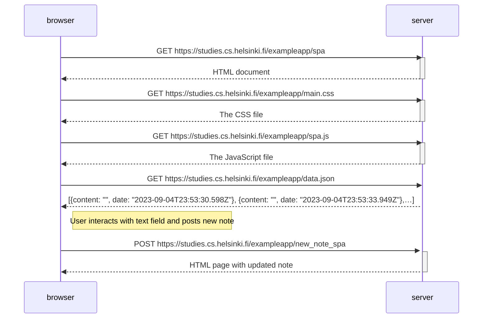

```mermaid
sequenceDiagram
    participant browser
    participant server

  browser->>server: GET https://studies.cs.helsinki.fi/exampleapp/spa
    activate server 
    server-->>browser: HTML document
    deactivate server 

    browser->>server: GET https://studies.cs.helsinki.fi/exampleapp/main.css
    activate server
    server-->>browser: The CSS file
    deactivate server

    browser->>server: GET https://studies.cs.helsinki.fi/exampleapp/spa.js
    activate server
    server-->>browser: The JavaScript file
    deactivate server

    browser->>server: GET https://studies.cs.helsinki.fi/exampleapp/data.json
    activate server
    server-->>browser: [{content: "", date: "2023-09-04T23:53:30.598Z"}, {content: "", date: "2023-09-04T23:53:33.949Z"},…]

    Note right of browser: User interacts with text field and posts new note

    browser->>server: POST https://studies.cs.helsinki.fi/exampleapp/new_note_spa
    activate server
    server-->>browser: HTML page with updated note
    deactivate server

```